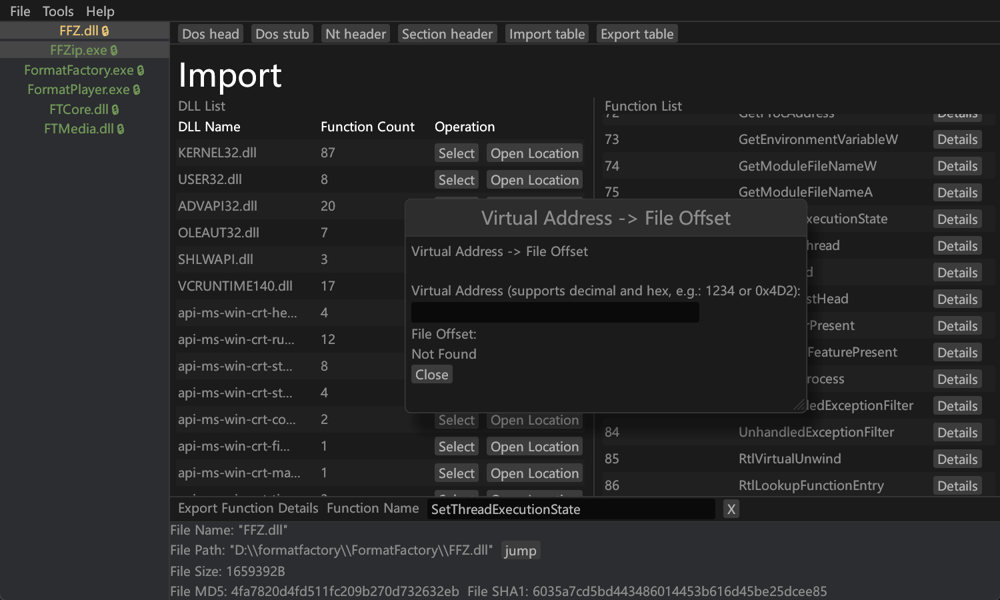

# Penguin

Penguin ———— 一个开源PE的文件解析工具，它起源于对PE的学习而产生的项目，它不会成为任何工具的代替品，而是为逆向分析者提供更多的选择




[English](README.md) | [中文](README.zh-CN.md)

---

## 编译
如果不修改语言的前提下，可直接编译
```shell
git clone git@github.com:dDostalker/Penguin.git
cd Penguin
cargo build --release
```

## 🔧功能
以下是Penguin的功能
- 查看PE文件中的常用信息
- 导入表导出表进行修改
- PE信息快速导出为json、toml
- 🚧资源一键提取
- 🚧动态链接自定义参数调试功能
- 🚧提供cli交互，为脚本工具提供便捷
- 🚧恶意PE分析相关功能（熵值计算，恶意导入表高亮）
- ……

## 💡使用Penguin的原因
- 支持多国语言，自定义添加语言（通过config文件夹下的toml文件设置后编译）
- 使用直接文件读写而并非将整个PE文件载入内存，针对大型PE、多PE文件同时操作提供支持
- 解决不分旧工具痛点，如导入导出表搜索，非常规段名称显示，gui界面等
- 开源工具，保证工具安全性，并持续吸收社区建议，有更多的发展潜力
- ……

## ⚠不足之处
- 功能不完善，调试等核心部分仍在开发
- ui界面存在不流畅
- 验证PE完整性不完善，对于针对Penguin恶意构造的PE可能存在解析错误
- 目前只支持和主机端序相同的PE

## 自定义语言

Penguin 使用了一个基于 `build.rs` 和宏的编译时，允许在编译时选择不同的语言。

### 系统架构

#### 1. 配置文件 (`config/language.toml`)
- 定义当前使用的语言
- 包含所有支持语言的文本内容
- 支持的语言：chinese, english(可以自己添加)

#### 2. 构建脚本 (`build.rs`)
- 在编译时读取配置文件
- 生成对应语言的常量代码
- 设置环境变量

#### 3. 模块 (`src/i18n.rs`)
- 包含构建时生成的常量
- 提供宏和工具函数
- 支持语言检测和格式化

### 使用方法

#### 1. 切换语言

编辑 `config/language.toml` 文件，修改 `language` 字段：

```toml
# 切换到英文
language = "english"

# 切换到日文
language = "japanese"

# 切换到韩文
language = "korean"

# 切换到中文
language = "chinese"
```

#### 2. 在代码中使用

##### 使用宏获取文本：
```rust
use crate::i18n;

// 获取应用标题
let title = i18n::APP_TITLE;

// 使用宏（推荐）
let title = i18n!(APP_TITLE);
```

##### 检查当前语言：
```rust
use crate::i18n;

// 检查是否为英文
if i18n::is_language("english") {
    // 英文特定逻辑
}

// 获取当前语言
let current_lang = i18n::get_current_language();
```

##### 格式化数字和地址：
```rust
use crate::i18n::utils;

// 根据语言格式化数字
let formatted = utils::format_number(1234567);

// 格式化地址
let addr = utils::format_address(0x12345678);
```

#### 3. 添加新的文本

1. 在 `config/language.toml` 中为所有语言添加新条目：
```toml
[chinese]
new_text = "新文本"

[english]
new_text = "New Text"
```

2. 在代码中使用：
```rust
let text = i18n::NEW_TEXT;
```

#### 4. 添加新语言

1. 在 `config/language.toml` 中添加新语言部分：
```toml
[german]
app_title = "Penguin PE Analysator"
# ... 其他文本
```

2. 在 `build.rs` 中更新默认配置（可选）

### 编译流程

1. `build.rs` 读取 `config/language.toml`
2. 根据 `language` 字段选择对应语言
3. 生成 `language_constants.rs` 文件
4. 设置 `CURRENT_LANGUAGE` 环境变量
5. 主程序编译时包含生成的常量

### 注意事项

1. 修改配置文件后需要重新编译
2. 所有语言必须包含相同的键
3. 生成的常量文件位于 `target/` 目录
4. 支持的语言在 `build.rs` 中硬编码

### 示例

#### 配置文件示例
```toml
language = "english"

[english]
app_title = "Penguin PE Analyzer"
welcome_message = "Welcome to Penguin!"

[chinese]
app_title = "Penguin PE 分析器"
welcome_message = "欢迎使用 Penguin！"
```
