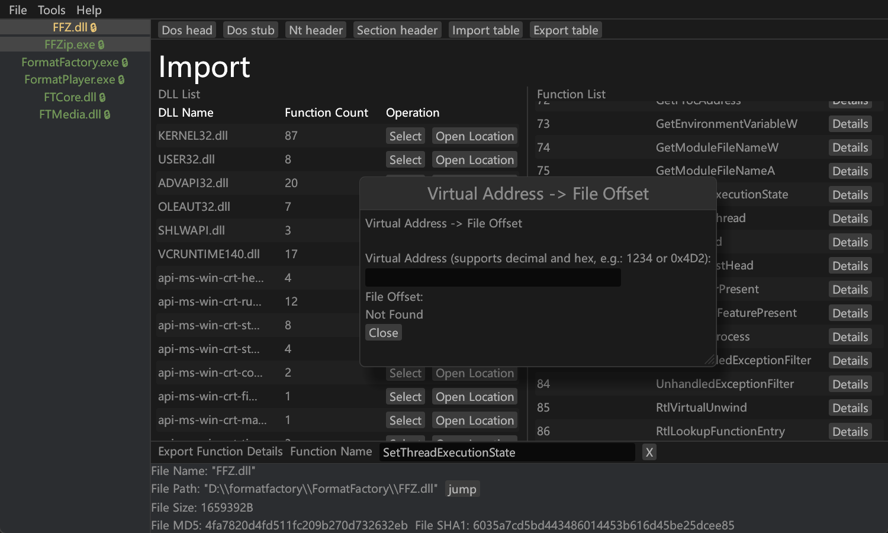

# Penguin

Penguin ———— An open-source PE file parsing tool that originated from a project born out of learning PE files. It is not intended to replace any existing tools, but rather to provide reverse engineers with more options.



[English](README.md) | [中文](README.zh-CN.md)

---

## Compilation
If you don't need to modify the language, you can compile directly:
```shell
git clone git@github.com:dDostalker/Penguin.git
cd Penguin
cargo build --release
```

## 🔧 Features
The following are Penguin's features:
- View common information in PE files
- Modify import and export tables
- Quickly export PE information as JSON and TOML
- One-click resource extraction
- 🚧 Dynamic linking with custom parameter debugging functionality
- Provide CLI interaction for convenient scripting tools
- 🚧 Malicious PE analysis related features (entropy calculation, malicious import table highlighting)
- ……

## 💡 Reasons to Use Penguin
- Supports multiple languages with custom language addition (set through TOML files in the config folder and then compile)
- Uses direct file I/O instead of loading entire PE files into memory, providing support for large PE files and simultaneous operation of multiple PE files
- Solves pain points of old tools, such as import/export table search, non-standard section name display, GUI interface, etc.
- Open-source tool ensuring tool security, continuously absorbing community suggestions with more development potential
- ……

## ⚠ Limitations
- Features are not complete, core parts like debugging are still under development
- UI interface has some performance issues
- Currently only supports PE files with the same endianness as the host

## Custom Language Support

Penguin uses a compile-time system based on `build.rs` and macros, allowing different languages to be selected at compile time.

### System Architecture

#### 1. Configuration File (`config/language.toml`)
- Defines the currently used language
- Contains text content for all supported languages
- Supported languages: chinese, english (you can add your own)

#### 2. Build Script (`build.rs`)
- Reads configuration file at compile time
- Generates constant code for the corresponding language
- Sets environment variables

#### 3. Module (`src/i18n.rs`)
- Contains constants generated at build time
- Provides macros and utility functions
- Supports language detection and formatting

### Usage

#### 1. Switching Languages

Edit the `config/language.toml` file and modify the `language` field:

```toml
# Switch to English
language = "english"

# Switch to Japanese
language = "japanese"

# Switch to Korean
language = "korean"

# Switch to Chinese
language = "chinese"
```

#### 2. Using in Code

##### Using macros to get text:
```rust
use crate::i18n;

// Get application title
let title = i18n::APP_TITLE;

// Using macro (recommended)
let title = i18n!(APP_TITLE);
```

##### Checking current language:
```rust
use crate::i18n;

// Check if it's English
if i18n::is_language("english") {
    // English-specific logic
}

// Get current language
let current_lang = i18n::get_current_language();
```

##### Formatting numbers and addresses:
```rust
use crate::i18n::utils;

// Format numbers according to language
let formatted = utils::format_number(1234567);

// Format addresses
let addr = utils::format_address(0x12345678);
```

#### 3. Adding New Text

1. Add new entries for all languages in `config/language.toml`:
```toml
[chinese]
new_text = "新文本"

[english]
new_text = "New Text"
```

2. Use in code:
```rust
let text = i18n::NEW_TEXT;
```

#### 4. Adding New Languages

1. Add new language section in `config/language.toml`:
```toml
[german]
app_title = "Penguin PE Analysator"
# ... other text
```

2. Update default configuration in `build.rs` (optional)

### Compilation Process

1. `build.rs` reads `config/language.toml`
2. Selects corresponding language based on `language` field
3. Generates `language_constants.rs` file
4. Sets `CURRENT_LANGUAGE` environment variable
5. Main program includes generated constants during compilation

### Notes

1. Recompilation required after modifying configuration file
2. All languages must contain the same keys
3. Generated constants file is located in `target/` directory
4. Supported languages are hardcoded in `build.rs`

### Examples

#### Configuration File Example
```toml
language = "english"

[english]
app_title = "Penguin PE Analyzer"
welcome_message = "Welcome to Penguin!"

[chinese]
app_title = "Penguin PE 分析器"
welcome_message = "欢迎使用 Penguin！"
```


